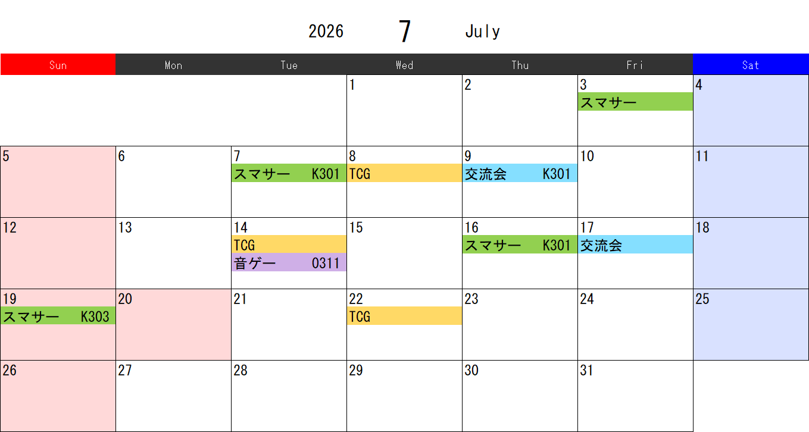

# Excel Calendar Generator

Pythonで月間カレンダーをExcelとして生成し、
PNG画像にも変換するツールです。

## Features

- 月間カレンダー生成
- 日本の祝日対応
- イベント登録
- イベントごとの色分け
- PNG画像出力

## Requirements

- Python 3.11+
- Microsoft Excel (Windows)

## Install

pip install openpyxl pillow pywin32 jpholiday

## Usage

python calendar.py

input.txt と setting.txt を編集して使用します。
input.txt には年月とイベント、setting.txt には色設定を記入します。

## Sample

付属の `input.txt` と `setting.txt` をそのまま使用すると、以下のようなカレンダー画像が生成されます。

